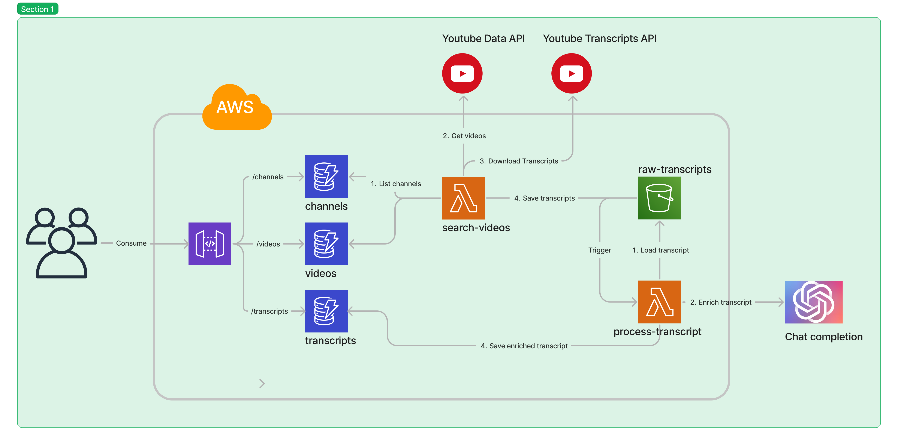

# YT Guesser
This is project for a  Youtube video guessing game. The goal of the game is guessing which youtuber said a given phrase. I am working on this alongside [ShooTex](https://github.com/ShooTeX) for [roxcodes](https://www.twitch.tv/roxcodes).  

I'm working on the backend while ShooTex is working on the frontend.

## What is this repo about?
The goal of this repo is to process youtube audio transcription into a more human readable state. 

In other words, transforming this:  
```
{
    "text": "today I'm going to put this weird thing",
    "start": 0.0,
    "duration": 3.659
},
{
    "text": "on my head and communicate with gpt4",
    "start": 1.8,
    "duration": 4.019
},
{
    "text": "using nothing but my thoughts growing up",
    "start": 3.659,
    "duration": 4.081
},
{
    "text": "my dad would always tell me damn it son",
    "start": 5.819,
    "duration": 3.78
},
{
    "text": "you need to use your brain more but I",
    "start": 7.74,
    "duration": 3.18
},
{
    "text": "never fully understood what he meant",
    "start": 9.599,
    "duration": 3.241
},
{
    "text": "until now the human brain is the most",
    "start": 10.92,
    "duration": 3.78
}
```  

Into this:  
```
{
    "curated": null,
    "video_id": "-HYbFm67Gs8",
    "speaker": null,
    "text": "Today, I'm going to put this weird thing on my head and communicate with GPT4 using nothing but my thoughts.",
    "url": "https://www.youtube.com/watch?v=-HYbFm67Gs8&t=-2",
    "start": -1410.0
},
{
    "curated": null,
    "video_id": "-HYbFm67Gs8",
    "speaker": null,
    "text": "Growing up, my dad would always tell me, \"Damn it, son, you need to use your brain more,\" but I never fully understood what he meant until now.",
    "url": "https://www.youtube.com/watch?v=-HYbFm67Gs8&t=3",
    "start": 3950.0
}
```
## Deployment of the API
Currently deployed to: https://sb7hqnc55b.execute-api.us-east-1.amazonaws.com/api

## Consuming from the API
### Authentication
Currently the API is open. No authentication required. But I intend to implement it in the future. 

### Channels
The channels resource shows all channels currently tracked by the app. The app tracks recently upload videos for all the channels available in this resource.  
```
List all channels: 
GET /channels

Get a channel:
GET /channels/{channel_id}
```

### Videos
The videos resource shows which videos are tracked by the API. These are the videos the app at least tried to generate enriched transcripts for.
```
List all videos:
GET /videos  

Get a video:
GET /videos/{video_id}
``` 
### Transcripts
The enriched transcripts for a video 
```
 GET /transcripts/{video_id}
```

## Architecture
The whole thing is hosted on AWS. I'm using AWS lambda to search for videos, download transcripts and enriching them with the OpenAI chat completion API.  

Here's a basic overview of the architecture:

